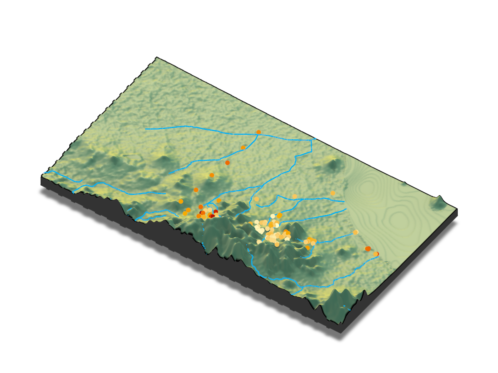

# Sierra Minera Soil Dataset – Reproducible Multi-element Mapping in R
[](https://doi.org/10.5281/zenodo.19441307)

This repository contains a reproducible method in **R** to integrate heterogeneous soil geochemistry datasets from the Sierra Minera mining district (Cartagena–La Unión, SE Spain) and generate **multi-element soil maps (Pb, Zn, As, Cd)**.

The code reorganizes raw laboratory spreadsheets into a spatial master table and uses that harmonized dataset to produce both exploratory and interpolated maps.

The raw datasets are archived in Zenodo, while this repository provides the reproducible scripts required to generate the maps in **R**.

---

# Table of Contents

- [Overview](#overview)
- [Context](#context)
- [Reproducible Methods](#reproducible-methods)
- [Scripts](#scripts)
- [Results](#results)
- [3D Terrain Visualization](#3d-terrain-visualization)
- [Interactive Map](#interactive-map)
- [Data Availability](#data-availability)
- [Data Sources](#data-sources)
- [Repository Structure](#repository-structure)
- [Status](#status)

---

# Overview

The purpose of this repository is to provide a reproducible method to generate **multi-element soil maps** for the Sierra Minera from heterogeneous geochemical datasets.

The method consists of three main steps:

1. Load heterogeneous Excel datasets  
2. Harmonize sample identifiers and UTM coordinates  
3. Generate multi-element maps in R from the harmonized spatial dataset  

The resulting workflow enables reproducible spatial analysis and visualization of trace elements in soils.

---

# Context

The datasets originate from soil geochemistry studies conducted in the Sierra Minera mining district.

The datasets used in this repository originate from soil geochemistry studies conducted by **José Matías Peñas Castejón** and collaborators in the Sierra Minera mining district (Cartagena–La Unión, SE Spain).

This repository reorganizes these heterogeneous sources into a reproducible spatial dataset suitable for open scientific analysis and cartographic visualization in **R**.

---

# Reproducible Methods

## Multi-element Mapping Workflow

The method implemented in this repository follows this logic:

```text
Raw Excel datasets
        ↓
Harmonization of sample IDs and UTM coordinates
        ↓
Construction of a master spatial table
        ↓
Extraction of total soil element concentrations (Pb, Zn, As, Cd)
        ↓
Interactive mapping in R (Leaflet)
        ↓
IDW interpolation and raster visualization with hillshade
```

## 3D Terrain Visualization Workflow

The repository also includes an experimental 3D visualization workflow:

```text
Master spatial table + total element concentrations
        ↓
Integration of elevation data (DEM)
        ↓
Integration of official drainage network (CNIG)
        ↓
3D terrain visualization (rayshader)
```

The raw data can be downloaded from Zenodo and placed in a local folder such as `raw_data/`.

Once configured, the scripts allow the user to reproduce all maps directly in **R**.


# Scripts

The reproducible code is located in the `R/` directory.

The repository uses a thematic script classification system. Script codes indicate the role of each workflow component rather than execution order.

For additional details, see:

**[SCRIPT_CODES.md](SCRIPT_CODES.md)**

---

## `R/0_build_samples_master.R`

Builds the harmonized spatial master table from heterogeneous spreadsheets.

Main tasks:

* load multiple Excel files
* normalize field sample identifiers
* extract UTM coordinates
* review duplicated coordinate records
* construct a master spatial table

---

## `R/0_build_total_elements_wide.R`

Builds a unified wide-format table containing total element concentrations extracted from the available laboratory datasets.

Main tasks:

* identify total soil element datasets
* harmonize sample identifiers
* extract elemental concentrations
* reshape data into wide format
* create a unified geochemistry table

---

## `R/0_build_geo_total_elements_wide.R`

Combines spatial and geochemical information into a single georeferenced dataset.

Main tasks:

* load or generate the master sample table
* retrieve elevation values from a Digital Elevation Model (DEM)
* join coordinates and elevation data
* integrate total element concentrations
* generate a unified geospatial geochemistry table

---

## `R/1_leaflet_total_elements_map.R`

Creates an interactive **Leaflet map of total soil element concentrations (Pb, Zn, As, Cd)**.

Main tasks:

* visualize sampling locations
* display multiple soil elements
* generate interactive map layers
* provide dynamic element selection

---

## `R/1_leaflet_idw_total_elements_map.R`

Generates interpolated **multi-element surfaces** using **Inverse Distance Weighting (IDW)** and overlays them on a DEM-derived hillshade.

Main tasks:

* interpolate element concentrations
* generate raster surfaces
* overlay terrain relief (hillshade)
* visualize multi-layer outputs interactively

---

## `R/1_map_pb_terrain_3d.R`

Creates an experimental 3D terrain visualization of the Sierra Minera using a Digital Elevation Model (DEM), Pb concentrations and the official drainage network.

Main tasks:

* generate a reduced DEM for 3D rendering
* visualize Pb concentrations in three dimensions
* integrate official hydrographic network data
* create interactive terrain visualizations with rayshader
* export PNG and HTML outputs

---

# Results

Example outputs generated by the reproducible code.

## Sampling points and element concentrations


## Interpolated raster surface (example: Pb)


---

# 3D Terrain Visualization

⚠️ **Work in progress**

The 3D visualization workflow is currently under active development and should be considered a first proof-of-concept rather than a final analytical product.

The objective is to integrate:

* Digital Elevation Models (DEM)
* Harmonized soil geochemistry datasets
* Pb sampling locations
* Official drainage network
* Future interpolated contamination surfaces

The current prototype combines terrain elevation, Pb concentrations, and the official hydrographic network to explore potential relationships between topography, drainage pathways, and contaminant distribution.

## Example output



## Data sources

The drainage network used in the 3D visualization was obtained from the Spanish National Centre for Geographic Information (CNIG) hydrography dataset:

:contentReference[oaicite:0]{index=0}

The dataset provides official hydrographic features and drainage network information for Spain, distributed as GeoPackage and Shapefile products under an open licence. :contentReference[oaicite:1]{index=1}

Future versions of the workflow may incorporate:

* Multi-element 3D visualization
* Interpolated contamination surfaces
* Surface runoff modelling
* Watershed analysis
* Human exposure and environmental risk layers

---

# Interactive Map

An interactive multi-element map (IDW + hillshade) is available online:

🔗 **[Open interactive map](https://rpubs.com/Cpurpurea/sierra-minera-multielement-idw-map)**

This map allows exploration of:

* multiple soil elements (Pb, Zn, As, Cd)
* interpolated surfaces
* sampling point data
* terrain context

---

# Data Availability

The raw soil geochemistry datasets used in this repository are archived in Zenodo:

[https://doi.org/10.5281/zenodo.18940847](https://doi.org/10.5281/zenodo.18940847)

This repository does not duplicate the archived raw dataset.
Instead, it provides the reproducible R workflow required to integrate and analyze the data.

---

# Data Sources

The workflow integrates heterogeneous laboratory datasets associated with soil geochemistry studies in the Sierra Minera mining district.

The geochemical data derive from research carried out by **José Matías Peñas Castejón** and collaborators. Additional spatial layers may incorporate official geospatial products from the Spanish National Centre for Geographic Information (CNIG).

CNIG Hydrography Download Centre:
https://centrodedescargas.cnig.es/CentroDescargas/hidrografia

The code does not modify the original datasets. Instead, it harmonizes and integrates them into a reproducible spatial workflow.

---

# Repository Structure

The repository uses a thematic script classification system. Script codes indicate their role within the workflow rather than execution order.

For a detailed description of the coding scheme, see:

**[SCRIPT_CODES.md](SCRIPT_CODES.md)**

```text
.
├── README.md
├── SCRIPT_CODES.md
├── R/
│   ├── 0_build_samples_master.R
│   ├── 0_build_total_elements_wide.R
│   ├── 0_build_geo_total_elements_wide.R
│   ├── 1_leaflet_total_elements_map.R
│   ├── 1_leaflet_idw_total_elements_map.R
│   └── 1_map_pb_terrain_3d.R
└── figures/
    ├── 02_script_result.png
    ├── 03_raster.png
    ├── sierra_minera_terrain_3d_pb_points_ramblas.png
    ├── sierra_minera_terrain_3d_pb_legend.png
    └── sierra_minera_terrain_3d_pb_points_ramblas.html
```

---

# Status

The repository currently provides a reproducible workflow for:

* harmonization of heterogeneous soil geochemistry datasets
* construction of a spatial master table
* interactive multi-element mapping
* IDW interpolation
* exploratory 3D terrain visualization

The project remains under active development.

Future developments may include:

* additional elements
* improved interpolation methods
* 3D contamination surfaces
* hydrological analyses
* statistical analysis of geochemical patterns
* integration with environmental and human exposure frameworks
```
