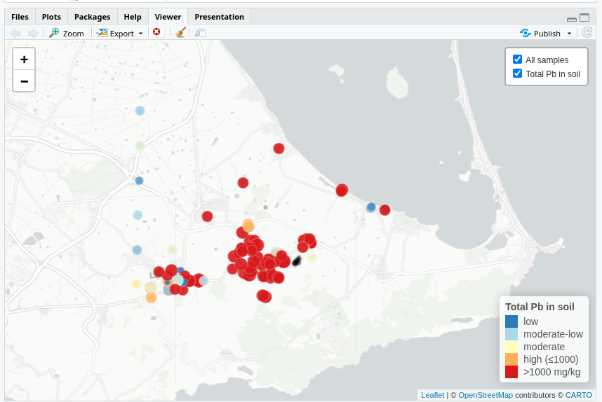
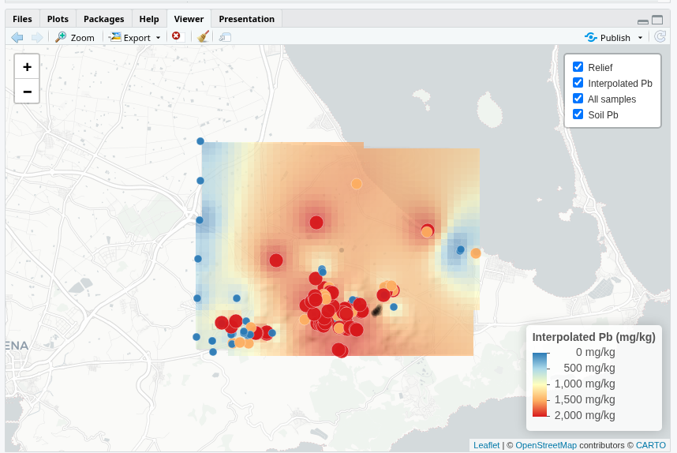

# Sierra Minera Soil Dataset – Reproducible Pb Mapping in R
[](https://doi.org/10.5281/zenodo.18940847)

This repository contains a reproducible method in **R** to integrate heterogeneous soil geochemistry datasets from the Sierra Minera mining district (Cartagena–La Unión, SE Spain) and generate **lead (Pb) maps** from those data.

The code reorganizes raw laboratory spreadsheets into a spatial master table and uses that harmonized dataset to produce exploratory and interpolated Pb maps.

The raw datasets are archived in Zenodo, while this repository provides the reproducible scripts required to generate the maps in **R**.

---

# Table of Contents

- [Overview](#overview)
- [Context](#context)
- [Reproducible Method](#reproducible-method)
- [Scripts](#scripts)
- [Results](#results)
- [Data Availability](#data-availability)
- [Data Sources](#data-sources)
- [Repository Structure](#repository-structure)
- [Status](#status)
---

# Overview

The purpose of this repository is to provide a reproducible method to generate Pb maps for the Sierra Minera from heterogeneous soil geochemistry spreadsheets.

The method consists of three main steps:

1. Load heterogeneous Excel datasets  
2. Harmonize sample identifiers and UTM coordinates  
3. Generate Pb maps in R from the harmonized spatial dataset  

The resulting code allows reproducible spatial analysis and visualization of lead concentrations in soils of the Sierra Minera.

---

# Context

The datasets originate from soil studies conducted in the Sierra Minera mining district.

Part of the material derives from laboratory datasets associated with research carried out by **José Matías Peñas Castejón** and collaborators.

This repository reorganizes these heterogeneous sources into a reproducible spatial dataset suitable for open scientific analysis and cartographic visualization in **R**.

---

# Reproducible Method

The method implemented in this repository is based on the following logic:

```text
Raw Excel datasets
        ↓
Harmonization of sample IDs and UTM coordinates
        ↓
Construction of a master spatial table
        ↓
Extraction of total Pb values
        ↓
Interactive Pb mapping in R
        ↓
Interpolated Pb surface and raster visualization
````

The raw data can be downloaded from Zenodo and placed in a local folder such as `raw_data/` (or any folder name chosen by the user).
Only the path configuration in the first script needs to be adjusted before running the code.

Once configured, the scripts allow the user to reproduce the Pb maps directly in **R**.

---

# Scripts

The reproducible code is located in the `R/` directory.

## `R/01_build_samples_master.R`

Builds the harmonized spatial master table from heterogeneous spreadsheets.

Main tasks:

* load multiple Excel files
* normalize field sample identifiers
* extract UTM coordinates
* review duplicated coordinate records
* construct a master spatial table

Main output fields:

```text
sample_id
type
number
utm_x
utm_y
```

---

## `R/02_map_total_pb_leaflet.R`

Creates an interactive **Leaflet map of total Pb concentrations in soil**.

Main tasks:

* identify total soil metal sheets
* extract Pb concentrations
* join Pb values with spatial coordinates
* display sampling points and Pb values interactively

---

## `R/03_interpolate_total_pb_idw_leaflet.R`

Generates an interpolated **Pb surface** using **Inverse Distance Weighting (IDW)** and displays it together with a DEM-derived hillshade background.

Main tasks:

* interpolate total Pb concentrations
* generate a raster surface
* overlay the raster on terrain relief
* visualize the result interactively in Leaflet

---

# Results

Example outputs generated by the reproducible code.

## Sampling points and Pb concentrations



## Interpolated Pb raster surface



## Interactive maps

Interactive HTML maps generated with Leaflet are available in the repository:

- [Pb sampling map](figures/Pb_map_Sierra_Minera.html)
- [Interpolated Pb map](figures/03_raster_pb_map.html)

  **Note:** GitHub does not render interactive Leaflet maps directly in the browser preview.  
To visualize the maps, download the HTML files and open them locally in a web browser.
---

# Data Availability

The raw soil geochemistry datasets used in this repository are archived in Zenodo:

[https://doi.org/10.5281/zenodo.18940847](https://doi.org/10.5281/zenodo.18940847)

This repository does not duplicate the archived raw dataset.
Instead, it provides the reproducible R code required to integrate those raw data and generate Pb maps for the Sierra Minera.

---

# Data Sources

The method integrates several heterogeneous laboratory spreadsheets and soil datasets associated with geochemical studies in the Sierra Minera mining district (Cartagena–La Unión, SE Spain).

The current version processes data from the following source files:

* `Totales_Suelos.xlsx` — total elemental concentrations in soils
* `DTPA_AGRICOLAS_NATURALES.xlsx` — DTPA-extractable trace elements in agricultural soils
* `Suelos_Agricolas_Inma_UBM_BARGE_BCR.xlsx` — sequential extraction data (BCR method)
* `TABLA_RESULTADOS_SUELOS_URBANOS.xlsx` — analytical results from urban soil samples
* `Laboratorio_SYNALAB_todos_los_resultados_por_capa_sellado.xlsx` — laboratory reports with analytical results by soil layer
* `ALEDO GUILLERMO BUENO.xls` — historical spreadsheet containing additional soil measurements

These files originate from laboratory analyses and research datasets compiled during soil geochemistry studies of the Sierra Minera.

The material derives from datasets associated with research carried out by **José Matías Peñas Castejón** and collaborators.

The code does not modify the original archived spreadsheets.
Instead, it reads and harmonizes these heterogeneous sources in order to generate reproducible Pb maps in **R**.

---

# Repository Structure

```text
.
├── README.md
├── R/
│   ├── 01_build_samples_master.R
│   ├── 02_map_total_pb_leaflet.R
│   └── 03_interpolate_total_pb_idw_leaflet.R
└── figures/
    ├── 02_script_result.png
    └── 03_raster.png
```

---

# Status

Initial reproducible method for Pb mapping in soils of the Sierra Minera.
Future developments may extend the code to additional elements, spatial products, and more general mapping workflows.

